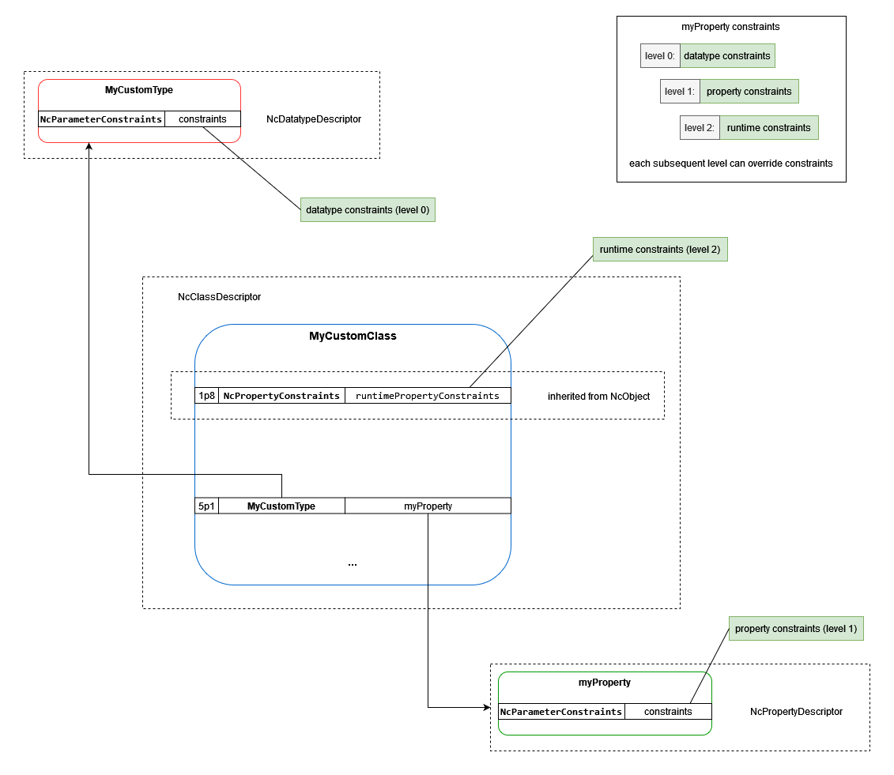

# Constraints

The framework allows devices to publish optional constraints for the models they implement.

There are three different levels of constraints:

- level 0: datatype constraints (provided through the [NcDatatypeDescriptor](Framework.md#ncdatatypedescriptor))
- level 1: property constraints (provided through the [NcPropertyDescriptor](Framework.md#ncpropertydescriptor) as part of an [NcClassDescriptor](Framework.md#ncclassdescriptor))
- level 2: runtime constraints (provided as a property inside [NcObject](Framework.md#ncobject))

When using multiple levels of constraints implementations MUST fully override the previous level and this MUST never result in widening the constraints defined in previous levels (e.g. property constraints for a numeric property cannot increase the maximum beyond the maximum specified by the datatype constraints).

Below is a constraints diagram presenting a property called `myProperty` of type `MyCustomType` inside a `MyCustomClass` class.

|  |
|:--:|
| _**Constraints levels**_ |
